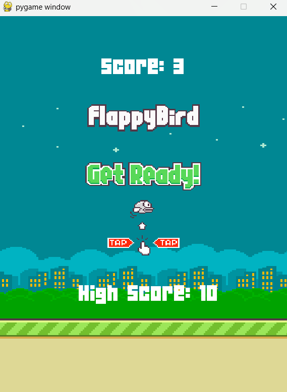

# Flappy Bird

I built a Flappy Bird game from scratch, focusing on smooth gameplay mechanics and responsive controls. The game features a simple yet polished design, with dynamically generated obstacles and a scoring system to keep players engaged. It was a fun project that helped me improve my skills in game physics and collision detection.
